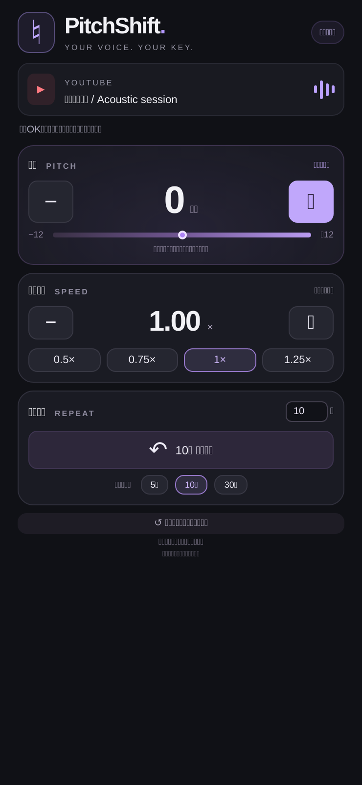

# PitchShift

YouTubeを、あなたの歌いやすいキーとテンポに。TypeScriptで作ったChrome拡張です。

- キー: −12〜＋12半音。速度とは独立して変更。
- スピード: 0.25〜2倍、0.05刻み。0.5 / 0.75 / 1 / 1.25倍のプリセット。
- 巻き戻し: 1〜60秒。5 / 10 / 30秒のプリセットと秒数の保存。
- キーと速度のリセット、日本語UI、キーボード操作、状態・エラー表示。



## 導入

Chrome 116以降、Node.js 20.6以降が必要です。

```sh
npm ci
npm run build
```

1. Chromeで `chrome://extensions` を開き、右上の「デベロッパーモード」を有効にします。
2. 「パッケージ化されていない拡張機能を読み込む」で、このリポジトリの **dist** フォルダを選択します。
3. 拡張の一覧からPitchShiftをツールバーに固定します。
4. YouTubeの動画を再生し、PitchShiftを開いて操作します。

WindowsのChromeからWSL内のファイルを選ぶ場合、エクスプローラーの `\\wsl.localhost\<ディストリビューション名>\home\daxubar\ts\pitchshift\dist` から選択できます。選べない場合はdistフォルダをWindows側へコピーしてください。

キーの＋／−を押すと、そのタブの音声処理が始まります。パネルを閉じても継続します。「原曲に戻す」またはリセットで音声処理を終了します。同時に処理できるのは1タブです。別タブで練習する前に、元のタブでキーを0に戻してください。速度は動画の現在値を読み取り、巻き戻し秒数のみ永続保存します。

## 検証

```sh
npm run check
npx playwright install chromium
npm run test:browser
npm run test:extension
npm run spec:validate
```

既存ブラウザを使う場合、UIテストには `CHROME_PATH`、拡張テストには `CHROMIUM_PATH` で実行ファイルを指定できます。拡張テストには拡張読み込みフラグをサポートするChromiumを使ってください。OpenSpecコマンドはnpm経由でOpenSpec 1.13.0とNode 22を実行します。

- 12件の単体テスト: 44.1/48kHzの音声変換、ステレオ一致、出力範囲、速度・シーク境界、対象URL。
- ブラウザUIテスト: Chrome APIのテストダブルでボタン操作、入力上限、リセット、非対応ページ、失敗時の表示、ポップアップサイズ。
- 実拡張スモークテスト: MV3読み込み、service worker / offscreen通信、実AudioWorkletによる合成音の変換。
- OpenSpecのstrict検証、TypeScript型チェック、本番ビルド。

実際のYouTube上でのタブキャプチャと聴感は未確認です。手動確認項目は [docs/manual-test.md](docs/manual-test.md) にあります。

## 音声・権限について

音声はAudioWorkletによる2窓の可変ディレイ方式で端末内だけで処理します。録音・保存・外部送信はしません。簡易リアルタイム処理のため短い遅延や音の揺れが生じ、特に大きなキー変更では音質が変わります。フォルマント保持には対応していません。YouTubeタブ全体の音声に作用するため広告も対象です。保護されたコンテンツやライブ動画ではキャプチャ・巻き戻しが制限される場合があります。

権限: `activeTab` / `scripting` は選択したYouTube動画の操作、`tabCapture` / `offscreen` はパネルを閉じても続く音声処理、`storage` は巻き戻し秒数の保存に使用します。

実装は [Chromeのタブ音声キャプチャ仕様](https://developer.chrome.com/docs/extensions/how-to/web-platform/screen-capture) に基づきます。

## OpenSpec / Git

最初にGitを初期化し、`feat/pitchshift-extension` ブランチを作成して開発しました。
[openspec/changes/add-pitchshift](openspec/changes/add-pitchshift) に提案、設計、受け入れ仕様、タスクを保存しています。実YouTubeでの手動確認前のため、変更はアーカイブしていません。
